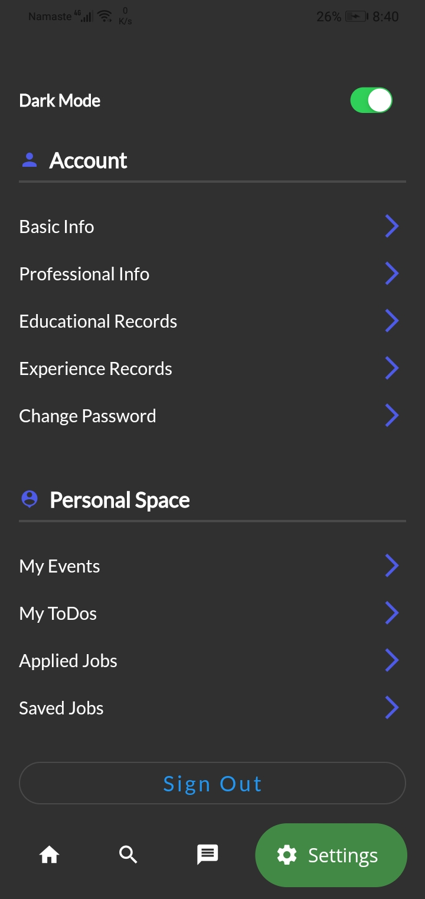
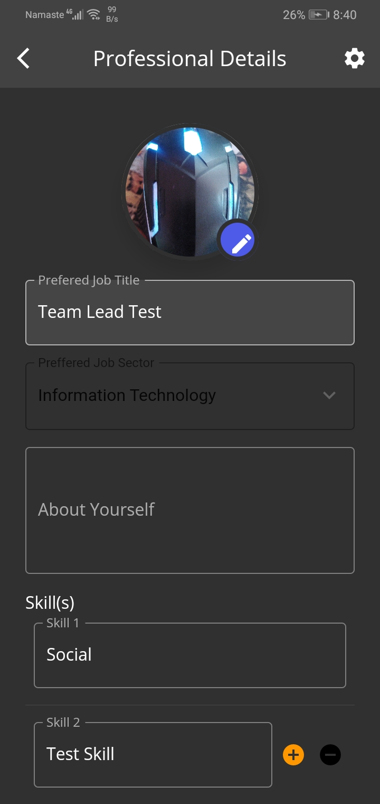
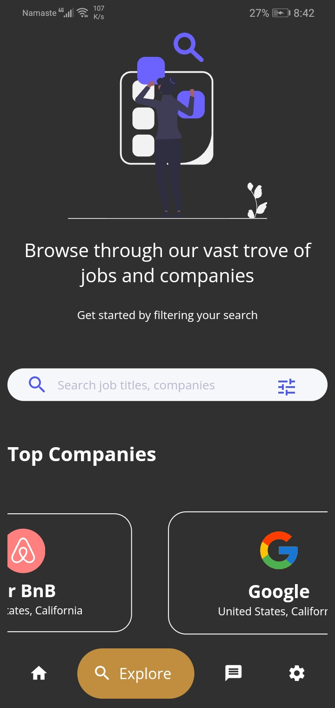

# HireHub

HireHub is the job platform with the target of simplifying recruiting and hiring process for the parties involved. With this application, employers, and potential employees could connect directly, efficiently cutting out the middleman. Moreover, with a real-time communication system integrated into this platform, employers can be confident about their applicants. In the favor of applicants, HireHub offers total transparency in their application process by informing them about state of their application
The process of searching jobs remains one of the most hassled tasks in one’s professional life. Furthermore, the lack of transparency in the process leaves the applicants unsure about their application. This creates sort of an unprofessional atmosphere between the employer and the potential employee.

To address these, HireHub was founded. With this platform, the job searching process will be made easier and hassle free. The users can apply for any job that matches their qualifications and skill sets. Their profile will directly be sent to the employers without having to upload a CV. In the favor of Employers, the employers can commit to 100% transparency of application by providing them with status of their application

# Hirehub Description
The application will consist of two users: Applicant, Employer and Admin. Although the admin dashboard will only be accessible through web platform, it will be able to manage all the users as well as the overall systems in this application. Speaking of Applicants, they will be able to view the jobs posted by several companies (Employers). Through this platform, the users will be allowed to browse, filter, and apply for the job that best suits their interests. The filter option will allow the users to narrow down the search to the post that best match their skill set or interests.

Moreover, the system will offer the users an option to save the job for latter. This option will enable users to efficiently handle the application for each individual job posts. In the favor of Employers, they will be able to post the job vacancies at their companies. The overall hiring process can be done through this platform. This includes job posting, shortlisting, interviewing, and onboarding. Once the application deadline closes, companies can handpick the candidates and shortlist them. They can communicate with them through real-time chat, emails or video conference (future work). Similarly, the system will automatically send them alerts about your decision and you can formally begin the onboarding process.


# Applicant Account's Feature
    •	Search For the Jobs
    •	Filter through Jobs
    •	Save jobs
    •	Real-Time communication with employer
    •	Add and Maintain education/personal/professional details
    •	Add and Maintain Events 
    •	Add and Maintain Todos
    •	View Applied Jobs and its status

# Company Account's Features
    •	Add Jobs
    •	View Applicants
    •	Filter and search through applicants
    •	Real-Time communication with company
    •	Add and Maintain company/personal details
    •	Add and Maintain Events 
    •	Add and Maintain Todos

# General App Features
    •	Offline Repository storage
    •	Responsive and Adaptive layout
    •	Use of sensors for accessibility (Proximity, Gyroscope and Accelerometer)
    •	Dark/Regular mode
    •	Real-Time Chat

# Challenges and fixes:
    •	Issues while integrating socket client with node socket server. This was mainly due to difference in versions of sockets and was resolved by downgrading node socket server 
    •	Issues while displaying app in larger screen due to static size config. This was resolved using media queries
    •	Overflowing of pixels in carousel slider. This was resolved by changing aspect ratio of cards in slider.

# Technologies used
Flutter was used as the primary technology to create interactive application in android platform. The main purpose of using flutter was due to the cross-platform nature of flutter. This allows developers to write one source code and convert it to code of any platform. Moreover, Flutter has the ability to customize anything you see on the screen, regardless of how complex it may be. While it’s usually possible to do a very custom UI on the native platforms as well, the amount of effort required differs by the order magnitude.

Next, Nodejs was used as the backend for HireHub. The main reason of using nodejs is its scalability. Node.js is well-suited for microservices architecture, which is really beneficial for the projects that will scale and grow in the future. Also, it is possible to create a separate microservice for any functionality, and then scale it separately from all other parts which is exactly what HireHub requires.

Furthermore, Socket.io was used in order to facilitate real time communication with the clients. Io enabled our application to communicate with server in real-time and facilitate communication between them.

Finally, Mongo dB was used as the storage solution of HireHub. The selling point of mongo was its flexibility and agility towards change. MongoDB’s document model allows virtually any data structure to be modeled and manipulated easily. MongoDB’s BSON data format, inspired by JSON, allows you to have objects in one collection with different sets of fields (say, a middle name on a user only when applicable, or region-specific information that only applies to some records).

# System Architecture:
HireHub is based on Repository Pattern Architecture. The repository pattern is intended to create an abstraction layer between the data access layer and the business logic layer of an application. It is a data access pattern that prompts a more loosely coupled approach to data access. We create the data access logic in a separate class, or set of classes, called a repository with the responsibility of persisting the application's business model.

In HireHub the data from server is loaded into the repository. The application makes request to the repository and based on the availability of server, the repository sends either the live data or the locally cached data from floor database.

# State Management

In HireHub. GetX was used for state management. GetX is an extra-light and powerful solution for Flutter. It combines high-performance state management, intelligent dependency injection, and route management quickly and practically.

Initially, GetX was used to store user’s state within the application like logging user’s login activity, darkmode preference, storing tokens, etc. Later on, it was also used for redirecting and navigating users based on their activites. 

# Use cases of GetX in HireHub:
    •	Logging user’s login activity
    •	Store User’s screen preference
    •	Toggle Dark Mode on/off
    •	Storing Tokens
    •	For routing and navigation
    •	Optimizing performance
    •	Caching data


# Future Works
    •	Integration of real time video conferencing solutions
    •	Integration of biometrics as an alternative for authentication
    •	Add options to enable users to upload files relevant to job application


## Screenshots










## Authors

- [@chirag123-bit](https://www.github.com/Chirag123-bit)


## Run Locally

Clone the project

```bash
  git clone https://github.com/Chirag123-bit/HireHub-Frontend.git
```

Go to the project directory

```bash
  cd HireHub-Frontend
```

Install dependencies

```bash
  npm install
```

Start the server

```bash
  npm start
```


## Running Tests

To run tests, run the following command

```bash
  npx jest
```

